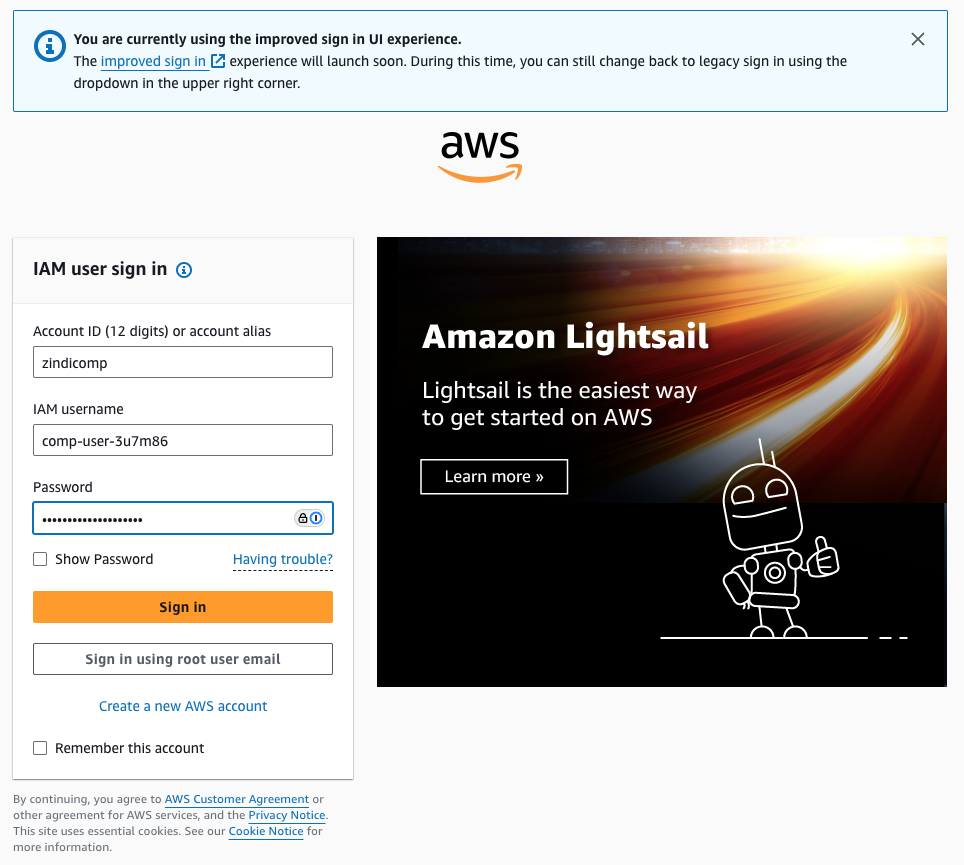

# AWS Sign In Guide

## Sign In URL

Use this URL to access the AWS Console:
<https://zindicomp.signin.aws.amazon.com>

This URL will automatically populate the account ID field.

## Account Details

- Account ID: 869935100875 (or zindicomp)
- Username Format: comp-user-XXXXXX (where XXXXXX is your assigned user ID)

## Sign In Steps

1. Navigate to <https://zindicomp.signin.aws.amazon.com>
2. The account ID field should be pre-filled with "zindicomp"
3. Enter your IAM username in the format: comp-user-XXXXXX
4. Enter your password
5. Click "Sign in"

## Troubleshooting

If you encounter sign in issues:

1. Verify you're using the correct:

   - Sign in URL
   - Account ID (869935100875 or zindicomp)
   - Username format (comp-user-XXXXXX)
   - Password

2. If you still cannot sign in:
   - Contact Zindi support
   - Provide your assigned username
   - They will verify your credentials and access

## Security Best Practices

- Do not share your credentials
- Use a strong password
- Enable MFA if provided
- Sign out when finished
- Clear browser cache/cookies if using a shared computer
